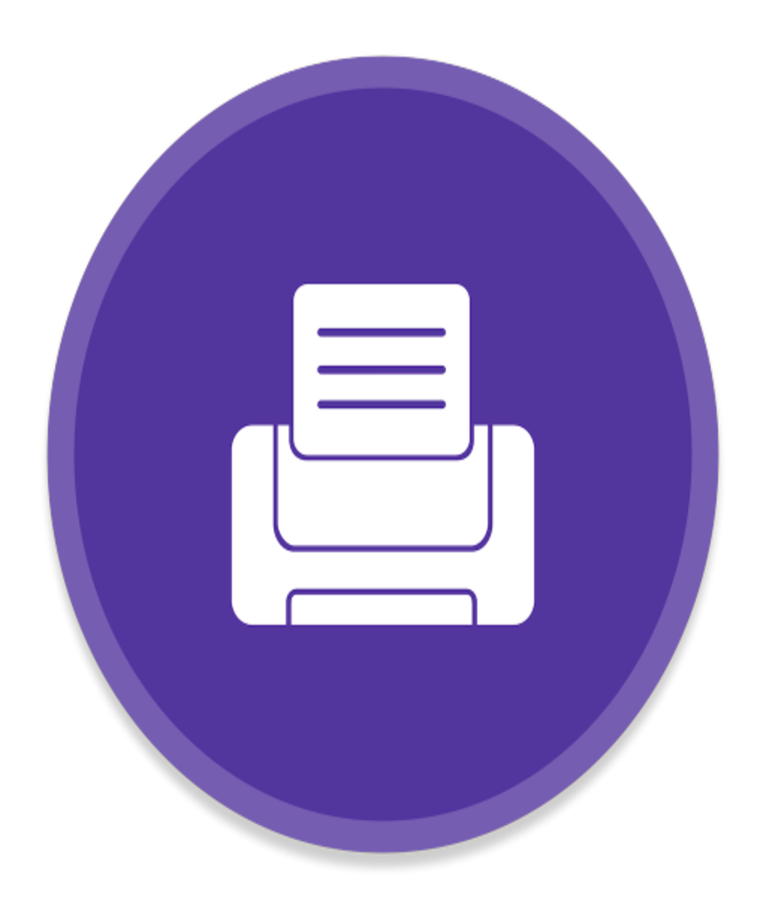

<h1 align="center">
 
  
 
 
Code Challenge - Electron
</h1>

In this code challenge we developed an app that provides an easy way to open favorite projects on VSCode.

feito no code challenge estou adptando para virar gerenciador de impressão

COMO usar Windos EX:

1* ir em empresoras e compartilhar a impressora com nome  impressjv
 
2* abrir terminar e definir a mesma para uso padrao 
 
   -- net use lpt1 \\127.0.0.1\impressjv  //difine a impressora 
 
   ----- echo ettett>lpt1                 //envia arquvi para impressao

ao installar seja como admin

npm install && npm start

  
  

